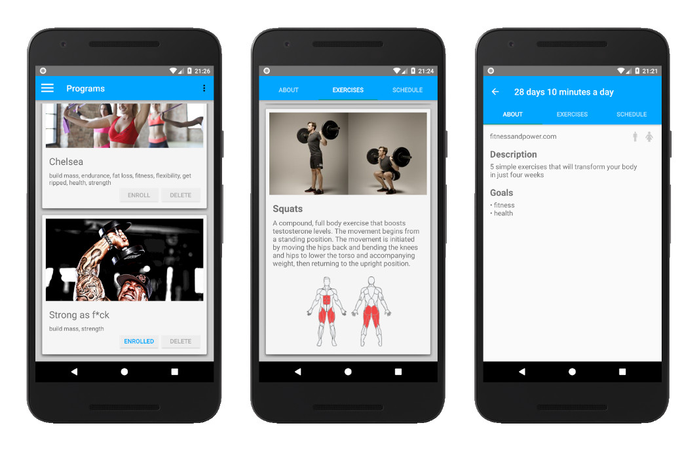
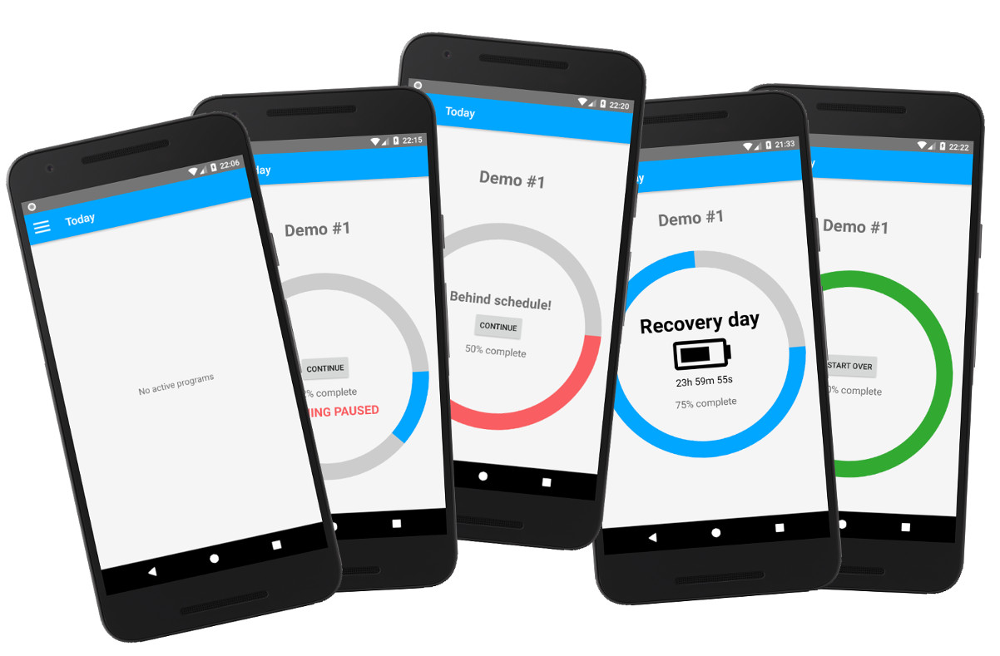
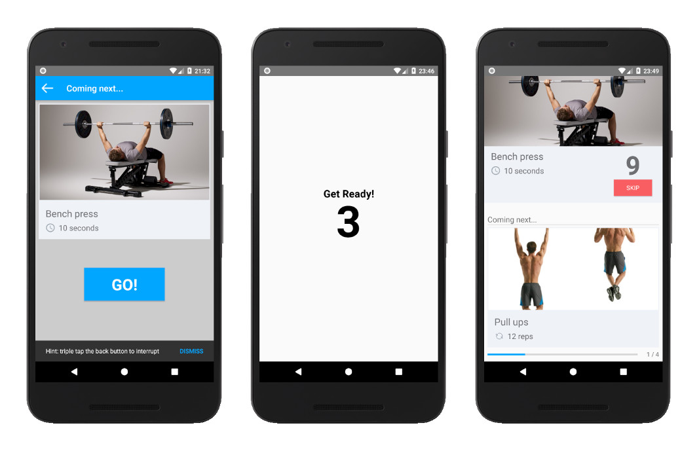
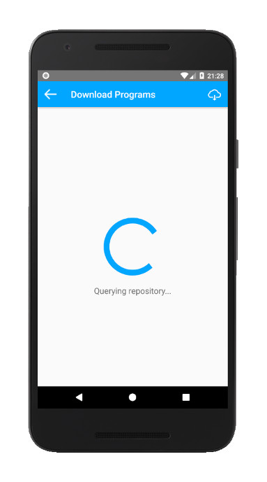

# Pocket Trainer

Personal trainer mobile app with the ability to install and playback arbitrary training programs stored in JSON format.

## Disclaimer

This is a proof of concept / prototype and therefore it lacks unit tests, contains a lot of duplication and generally does not follow any good programming principles. Other than that there are some binary assets such as images and sounds that have been used or modified without consent of their respective authors.

## Tools Used

* [Android Studio](https://developer.android.com/studio/) (development)
* [Audacity](https://www.audacityteam.org/) (sound effects)
* [GIMP](https://www.gimp.org/) (image editing)
* [Marvel](https://marvelapp.com/) (UI design)
* [MuscleWiki](https://musclewiki.org/) (sprites)
* [PythonAnywhere](https://www.pythonanywhere.com/) (web hosting)
* [Trello](https://trello.com/) (project management)

## Feature Overview

### Splash Screen

* A full-screen splash is shown with a spinning wheel while resources are being loaded.

### Training Programs

* The application comes with some bundled training programs for demonstration purposes. They are installed on the fist run but can be restored later if deleted.
* More programs can be copied or downloaded manually and installed from a local file on the device as long as user grants appropriate permissions.
* Training programs can be also downloaded and installed directly from the app using a remote repository.
* There is a default [public repository](http://asdf.pythonanywhere.com/pocket-trainer) of training programs available on-line.
* Remote programs can be queried and downloaded selectively.
* Flexible file format allows for defining brand new custom training programs.

### Program Browser

* Installed programs can be browsed, explored, enrolled to or deleted (individually or all at once).
* Basic infomation about a program includes its goals, target gender, name, author, description and schedule.
* Detailed view of a training program shows instructions on how to correctly perform each exercise.
* Apart from textual description exercises have a corresponding image and a figure depicting muscle groups activated (synthesized dynamically from sprite images).
* To restart an active program one can simply unenroll from and enroll to the same program again. Only finished programs can be started over from today's view.



### Today View

* User can commit and enroll to at most one training program at a time.
* If user is not enrolled yet he is directed to program browser when aplication starts. Otherwise today's view is shown.
* There are multile states a training program can be in:
    - *none* (no active programs)
    - *new* (enrolled but not started yet)
    - *ready* (time for training)
    - *belated* (behind schedule)
    - *in* progress (training interrupted)
    - *recovery* day (break from physcial activity)
    - *finished* (training completed, can restart or choose another one)
* A circular progress bar indicates training status with different colors
    - *blue* - on track
    - *red* - behind schedule
    - *green* - training completed
* Message "Training Paused" is flashing when training had been interrupted.
* During a recovery day a countdown shows how much time is left until the next training.



### Personal Trainer

* Core functionality of the application is a metronome-like visual and audio instructions served automatically according to a chosen training program.
* Prior to starting a new training session an upcoming view shows what exercise to expect before hitting the "Go" button. User may change his mind and back out, e.g. because of the need for heading to the gym.
* Afterwards the user is embraced with a brief countdown.
* In general a training session should not be interrupted but for emergency purposes one can pause it by triple tapping the back button or by tapping the home button.
* For this reason training instructions are displayed in full-screen mode.
* At each step the user is given visual information about:
    - current training progress, i.e. how many actions are already completed vs. total number of actions left today;
    - next coming action - specifically, its name, type with value (timed vs. reps) and image.
* Optional voice instructions as well as optional vibrations are given about:
    - time left (countdown like 3..2..1.. as well as round numbers such as 60 seconds);
    - the next action, its type and value (seconds or reps);
    - end of workout is also announced.
* Timed actions are automatically completed and advanced to the next one after a certain amount of time elapses.
* Some actions require user interaction to be marked complete, e.g. to indicate that a particular number of reps has been reached or when user decided to end a recovery break (perhaps he waited at the gym until a machine became available).
* Each action can be skipped regardless of its type.



### Progress

* There is a rudimentary history log of completed or skipped exercises.
* The log is stored in an append-only fashion using plain CSV file with the following columns:
    - *started_at* (ISO 8601 UTC)
    - *finished_at* (ISO 8601 UTC)
    - *skipped* (boolean)
* This can be used to infer duration of training sessions, if the user was behind schedule, which days, what exercises were involved, etc.
* When a training program is unenrolled from, started over or deleted entirely the corresponding progress is gone.
* Currently there is now way of retaining progresses of past trainings.

### Configurability

* Virtual trainer can be personalized by toggling TTS voice instructions, music and sound effects as well as phone vibrations.
* Users can direct the app to custom repositories of training programs by providing a URL.
* An option to set defaults.

## On-line Repository

{:style="float: right; height: 450px;"}

There is a default [public repository](http://asdf.pythonanywhere.com/pocket-trainer) the application uses for querying and downloading training programs. However, users are free to use their own private repositories since repository URL is configurable. A sample repository server comes with this project as a tiny Python/Flask script (about 50 lines of code).

### API

#### Index

Query the repository for available training programs. Each entry contains the corresponding filename and program metadata including optional Base64-encoded image thumbnail. The response also provides version information to allow for backwards-compatible enhancements such as filters and exclusions in the future.

##### Request

`GET /`

##### Response

```json
{
    "format_version": "1.0",
    "programs": [
        {
            "filename": "28days.zip",
            "format_version": "1.0",
            "metadata": {
                "author": "fitnessandpower.com",
                "description": "5 simple exercises that will transform your body in just four weeks",
                "goals": [
                    "fitness",
                    "health",
                    "fat loss"
                ],
                "image": "iVBORw0KGgoAAAA(...)",
                "name": "28 days 10 minutes a day",
                "targetGender": "any"
            }
        }
    ]
}
```

#### Download

Request the download of a specific training program.

##### Request

`GET /28days.zip`

##### Response

```
HTTP/1.1 200 OK
Content-Type: application/zip
Content-Length: 116041
Cache-Control: public, max-age=43200

(...)
```

## File Format

Training programs are stored as ZIP archives with at least one mandatory file inside, which is expected to be found at the root level. The file must be named `program.json` and should conform to a well-known schema. Apart from that ZIP files can contain arbitrary folders and subfolders for binary assets such as images, the mentioned file can refer to via relative paths.

## Installation

After being downloaded a training program is extracted to a temporary location. Its `program.json` file is then deserialized and inspected. Files with unsupported format version are rejected immediately.

During unmarshalling data from JSON the relative paths of binary assets are rewritten with absolute paths using device's storage (application space). As a result of that JSON files saved on the device are different from the downloaded ones.

Moreover, original file names are replaced with MD5 hash sums of files' contents. This allows for detecting and reusing identical files, which is often the case with exercises shared between programs. It also allows to detect already installed programs as well as uniquely identify training programs.

> Note: In order to ensure consistent MD5 hash sum calculation, JSON attributes must be stored in the exact same order. Therefore, JSON marshaller assumes Android's default implementation of JSONObject to be using LinkedHashMap. If this ever changes, it will break the application!

In the end that temporary folder is released with all its contents.

## Caching

Since training programs are immutable a caching layer has been introduced to avoid repetitive and unnecessary I/O operations. The cache is only invalidated when a new program is installed or an existing one gets deleted.

## JSON Schema

To allow for future modifications of the schema a `program.json` must provide `format_version` attribute at the top level.

```json
{
    "format_version": "1.0"
}
```

Following that is the `program` attribute which groups three more children, i.e. `metadata`, `definitions` and `schedule`:

```json
{
    "format_version": "1.0",
    "program": {
        "metadata": {

        },
        "definitions": {

        },
        "schedule": [

        ]
}
```

### Metadata

This attribute provides training program's description, which may be used for searching and filtering in the future.

#### Exmaple

```json
{
    "program": {
        "metadata": {
            "author": "fitnessandpower.com",
            "name": "28 days 10 minutes a day",
            "description": "5 simple exercises that will transform your body in just four weeks",
            "targetGender": "any",
            "goals": [
                "fitness",
                "health",
                "fat loss"
            ],
            "image": "assets/fit-body.jpg"
        }
    }
}
```

#### Data Types

> Note: Unknown enum values are ignored.

```hjson
"metadata": {
    "author": String,
    "name": String,
    "description": String,
    "targetGender": Enum<any|male|female>,
    "goals": List<Enum<build_mass|endurance|fat_loss|fitness|flexibility|get_ripped|health|strength>>,
    "image": String
}
```

### Definitions

To avoid redundancy, e.g. by repeating the same exercise across multiple days or by duplicating days, a concept of definition was introduced. A definition is an arbitrary JSON object with a name, which resembles a variable in a programming language.

The `definitions` attribute is expected to contain two children, namely `exercises` and `days`.

```json
{
    "program": {
        "definitions": {
            "exercises": {

            },
            "days": {

            }
        }
    }
}
```

Definitions can be later referenced by prepending an at-sign `@` to their names, e.g.

```json
{
    "type": "@push-ups"
}
```

or

```json
[
    "@workout1"
]
```

#### Exercises

An exercise has:

- name
- textual description
- optional image
- collection of muscle groups it engages

Muscle groups are used to dynamically synthesize a visual figure comprised of superimposed sprites (source: [MuscleWiki](https://musclewiki.org/)).

##### Example

```json
{
    "program": {
        "definitions": {
            "exercises": {
                "push-ups": {
                    "muscles": [
                        "biceps",
                        "deltoids",
                        "pecs",
                        "triceps"
                    ],
                    "text": "The push-up is the ultimate bodyweight exercise (...)",
                    "image": "assets/push-ups.jpg"
                }
            }
        }
    }
}
```

##### Data Types

> Note: Unknown enum values are ignored.

```hjson
String: {
    "muscles": List<Enum<back_lower|biceps|calves|deltoids|forearms|glutes|hamstrings|lats|obliques|pecs|quads|traps|triceps>>,
    "text": String,
    "image": String
}
```

#### Days

Training programs are measured in days which is the smallest unit of time. A design decision was made not to allow more than one workout per day, although it can be hacked around by incorrectly treating exercises as workouts.

Some training programs might target muscle groups on different days, which is often referred to as the "split". In such a case one would want to give a meaningful name to a respective day definition, e.g. "leg-day".

##### Example

```json
{
    "program": {
        "definitions": {
            "days": {
                "recovery": {
                    "type": "recovery"
                },
                "workout1": {
                    "type": "workout",
                    "routine": [
                        {
                            "type": "@plank",
                            "goal": "seconds",
                            "value": 60
                        },
                        {
                            "type": "timed_recovery",
                            "seconds": "10"
                        },
                        {
                            "type": "@push-ups",
                            "goal": "seconds",
                            "value": 60
                        }
                    ]
                }
            }
        }
    }
}
```

There are two predefined kinds of days (*recovery* and *workout*) but future versions may introduce more such as *running*, *swimming*, *cycling*, etc.

Recovery is meant to signal a restraint from physical activity on a particular day. It is perfectly feasable for a few recovery days to exist in a row.

##### Example

```json
{
    "type": "recovery"
}
```

##### Data Types

```hjson
{
    "type": Enum<recovery|workout>
}
```

Workout comprises a *routine* which is a sequnce of *actions* to be perfromed during a training session.

##### Example

```json
{
    "type": "workout",
    "routine": [

    ]
```

##### Data Types

```hjson
{
    "type": Enum<recovery|workout>
    "routine": List<Action>
}
```

#### Action

Action is a specialization of an *exercise* with addtional information, e.g. whether an exercise should be time-boxed or not. In future versions actions may be augmented with even more details such as the amount of weights to lift.

> Note: Other than built-in "*recovery*"" and "*timed_recovery*"", action type must always reference an exercise definition.

##### Example

```json
{
    "type": "@plank",
    "goal": "seconds",
    "value": 60
}
```

Another type of action is one with reps instead of seconds, which allows the user to perform the exercise at his own pace. This may become more desirable depending on the training programs's goal.

##### Example

```python
{
    "type": "@squats",
    "goal": "reps",
    "value": 5
}
```

##### Data Types

```hjson
{
    "type": String,
    "goal": Enum<seconds|reps>,
    "value": Integer
}
```

Some actions do not have a corresponding exercise at all. These are called *recovery* actions and similarly they come in two flavours.

##### Example

```json
{
    "type": "timed_recovery",
    "seconds": "10"
}
```

##### Data Types

```hjson
{
    "type": Enum<recovery|timed_recovery>,
    "seconds": Integer
}
```

or

##### Example

```json
{
    "type": "recovery"
}
```

##### Data Types

```hjson
{
    "type": Enum<recovery|timed_recovery>,
}
```

Typically actions with an exercise to perform are interlaced with recovery actions. However, some workouts may define so called "supersets" without resting periods between exercises. The application shows next upcoming action at all times, so that the user can prepare himself.

### Schedule

Schedule is a flat continuous list of days. Some days may be recovery days, while others provide a routine to exercise on that day. There is no strict correspondence to calendar days other than their monotonic subsequence. It does not matter what day of week or month a user starts the training program. Once he decides to start, however, that day marks the beginning for all the remaining days.

In case of a missed workout the application just informs the user about being behind schedule, but does not skip to the next day. Instead it waits allowing the user to finish outstanding days. This is also by design.

An estimated time of the next training session is calculated by taking last workout's duration, number of recovery days ahead and current time into account.

> Note: Day cannot be specified in place but rather must reference a definition. This may change in future implementations.

#### Exmaple

```json
{
    "program": {
        "schedule": [

            "@workout1",
            "@workout2",
            "@workout3",

            "@recovery",

            "@workout2",
            "@workout2",

            "@recovery"
        ]
    }
}
```

#### Data Types

```hjson
"schedule": List<Day>
```

## TODO

### Must have

* Prepare test data with muscles, genders, superset (no gaps between actions), different kinds of actions, etc.

### Bugs and glitches

* "Go" not shown / zero not spoken on real device (timed recovery action).
* Changing screen orientation breaks the countdown.
* When finished and clicking "Start over", the upcoming exercise is displayed. However, when clicking back it should go to today rather than "Start over" again.
* Menu icon in the program browser should be white instead of black (three dots in the upper right corner).
* Back button sometimes allows to navigate to forbidden views.

### Nice to have

* Handle incoming calls correctly.
* On-line wizard and a searchable database to create and publish training programs. Ability to reuse e.g. exercises.
* When querying training program repository, send already installed programs to avoid downloading them unnecessarily (requires to bump format version on the client; the server should be backwards-compatible).
* Show enrolled first or display selected program more prominently (sorting?).
* Program browser search and filter.
* Integrate running, maps and location (distance vs. time).
* Configurable number of seconds (e.g. announcement every 30 seconds, countdown when <= 10 seconds, etc.)
* Default music / custom music / vibrate / turn off.
* Variable (random?) music samples.
* Spotify integration.
* Multiple languages.
* Configurable TTS language and locale.
* Pre-generate TTS for better performance (earcon?).
* Audio mixer (volume down when speaking).
* Cast to ChromeCast.
* Responsive design (different screen orientations and sizes).
* Improve performance.
* Automatically navigate to today view when recovery day elapsed.
